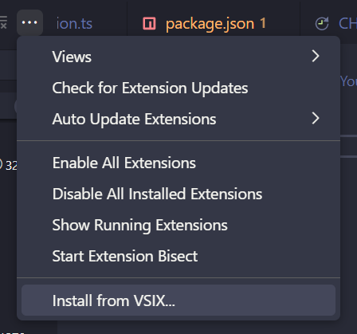
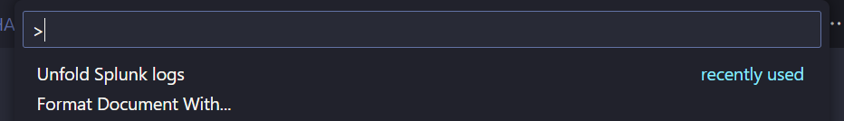
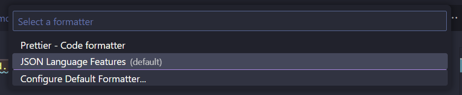

# splunk-unfold

Transform your exported splunk logs into valid json files.

## Installation
Download the latest [release](https://github.com/free-bots/splunk-unfold/releases). Than go to the extension overview (`ctrl+shift+x`) and click on the three dots. Click on `Install from VSIX` and open the last release .vsix file.



## Usage 
Open your splunk log export json file, run Show All Commands (`ctrl+shift+p`) and select `Unfold Splunk logs`:

If you have multiple formatters installed, you will be asked to select your preferred one and the transformation is done:

Otherwise you have to format the document yourself after the transformation (`shift+alt+f`).

## Build from source
```bash
git clone https://github.com/free-bots/splunk-unfold.git
cd splunk-unfold
npm i
npm run package:vsix
```
